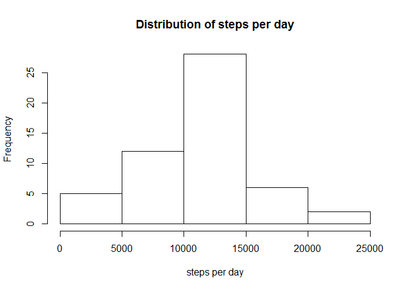
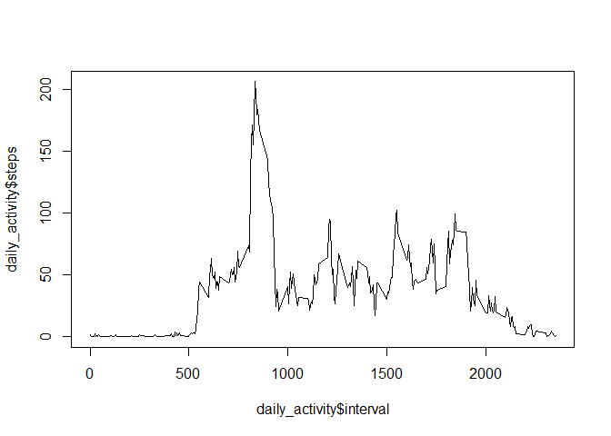
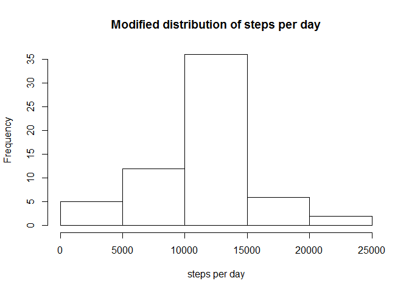

# Reproducible Research: Peer Assessment 1

# Loading the data

```r
activity <- read.csv("activity.csv")
head(activity)
```

```
##   steps       date interval
## 1    NA 2012-10-01        0
## 2    NA 2012-10-01        5
## 3    NA 2012-10-01       10
## 4    NA 2012-10-01       15
## 5    NA 2012-10-01       20
## 6    NA 2012-10-01       25
```

#Total number of steps taken per day

###Ignoring the missing values in the dataset

```r
activity_filtered <- na.omit(activity)
```

##1. Make a histogram of the total number of steps taken each day
###Process/transform the data

```r
steps_per_day <- aggregate(steps ~ date,
                          data = activity_filtered,
                          FUN = sum)
```

```r
hist(steps_per_day$steps, main="Distribution of steps per day", xlab="steps per day")
```

 

##2. Calculate and report the **mean** and **median** total number of steps taken per day

```r
mean(steps_per_day$steps)
```

```
## [1] 10766.19
```

```r
median(steps_per_day$steps)
```

```
## [1] 10765
```

#Average daily activity pattern

###Process/transform the data

```r
daily_activity <- aggregate(steps ~ interval,
                          data = activity_filtered,
                          FUN = mean)
```

##1. Time series plot of the 5-minute interval (x-axis) and the average number of steps taken, averaged across all days (y-axis)

```r
plot(x=daily_activity$interval,
     y=daily_activity$steps,
     type="l")
```

 

##2. The 5-minute interval, on average across all the days in the dataset, with the maximum number of steps

```r
max_daily_steps <- max(daily_activity$steps)
daily_activity[daily_activity$steps==max_daily_steps,"interval"]
```

```
## [1] 835
```

#Inputing missing values

###Note that there are a number of days/intervals where there are missing values (coded as `NA`). The presence of missing days may introduce bias into some calculations or summaries of the data.

##1. Calculate and report the total number of missing values in the dataset (i.e. the total number of rows with `NA`s)

```r
sum(is.na(activity$steps))
```

```
## [1] 2304
```

##2. Devise a strategy for filling in all of the missing values in the dataset. The strategy does not need to be sophisticated. For example, you could use the mean/median for that day, or the mean for that 5-minute interval, etc.
####Activity data with missing steps will be replaced with the average steps per interval
         
##3. Create a new dataset that is equal to the original dataset but with the missing data filled in.

```r
mean_steps_per_interval <- mean(activity_filtered$steps)

activity_modified <- activity
activity_modified$steps <- ifelse(is.na(activity$steps), 
                                  mean_steps_per_interval,
                                  activity$steps)
```

##4. Make a histogram of the total number of steps taken each day and Calculate and report the **mean** and **median** total number of steps taken per day. Do these values differ from the estimates from the first part of the assignment? What is the impact of imputing missing data on the estimates of the total daily number of steps?

###Process/transform the data

```r
modified_steps_per_day <- aggregate(steps ~ date,
                          data = activity_modified,
                          FUN = sum)
```


```r
hist(modified_steps_per_day$steps, main="Modified distribution of steps per day", xlab="steps per day")
```

 

```r
#New mean:
mean(modified_steps_per_day$steps)
```

```
## [1] 10766.19
```

```r
#New median
median(modified_steps_per_day$steps)
```

```
## [1] 10766.19
```

```r
#Old mean:
mean(steps_per_day$steps)
```

```
## [1] 10766.19
```

```r
#Old median
median(steps_per_day$steps)
```

```
## [1] 10765
```
####Replacing missing values with the average steps per interval has increased the number of days with an average number of steps, as seen in the histogram. This might be due to entire days being composed mostly of NAs and now becoming a day with an average number of steps. The fact that the new mean is the same as the old and the new median has become the same as the mean supports this hypothesis.

#Are there differences in activity patterns between weekdays and weekends?

##1. Create a new factor variable in the dataset with two levels -- "weekday" and "weekend" indicating whether a given date is a weekday or weekend day.

```r
activity_modified$day_type <- as.factor(ifelse((weekdays(as.Date(activity_modified$date)) %in% c("Saturday", "Sunday")),
                                        "weekend",
                                        "weekday"))
```
##Process data

```r
library(dplyr)
```

```
## 
## Attaching package: 'dplyr'
## 
## The following object is masked from 'package:stats':
## 
##     filter
## 
## The following objects are masked from 'package:base':
## 
##     intersect, setdiff, setequal, union
```

```r
new_daily_activity <- summarise(group_by(activity_modified, interval, day_type), steps=mean(steps))
library(lattice)
```

##1. Make a panel plot containing a time series plot (i.e. `type = "l"`) of the 5-minute interval (x-axis) and the average number of steps taken, averaged across all weekday days or weekend days (y-axis).

```r
xyplot(steps ~ interval|day_type, t="l", data=new_daily_activity, layout=c(1,2))
```

 
